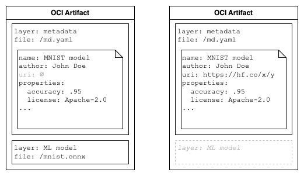
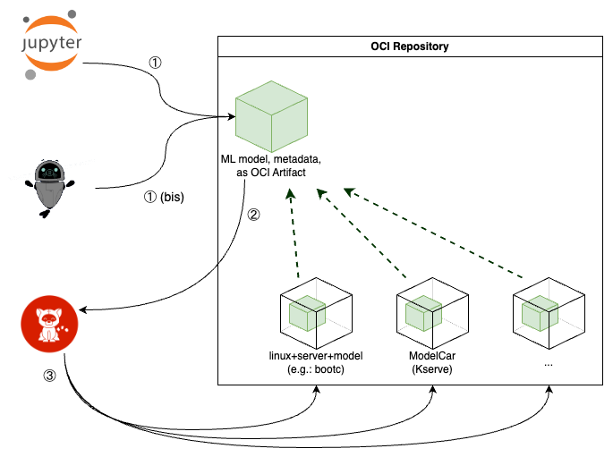

# Overview

This project aims to demonstrate how ML model and related metadata can be stored as an OCI Artifact and then leverage the vast OCI/Container ecosystem and infrastructure for comprehensive MLOps.

!!! tip "For the impatients"

    You can jump straight to [Demo 1](demos/demo.md).

The proposed OCI Artifact for ML model and metadata can be organized and then stored in OCI compliant registries with a format similar to the following:



Please note in the first case, both the actual ML model file (`mnist.onnx` file) and its metadata, can be stored in an OCI artifact.

In the second case, the OCI artifact does not contain the actual model file, as its metadata is referring a model already existing on external storage, such as HuggingFace hub, but similarly it could be pointing at a git repository with lfs support, an S3 bucket coordinates, etc.

!!! note

    The OCI artifact without model and only metadata is considered highly experimental.

That represents an unified format to represent the ML model and its metadata as OCI Artifact, while keeping some flexibility on the actual storage solution (external reference). The first provides additional advantages such as an unified distribution mechanism for local, cached, disconnected environments, enabled by the OCI-Dist spec and related infrastructure.

## Example

As a concrete example, let's consider a manifest for an OCI Artifact for ML model and metadata where:

- the Manifest's `.config` points to the layer containing metadata, following [OCI Image spec recommendation](https://github.com/opencontainers/image-spec/blob/main/manifest.md#guidelines-for-artifact-usage)
- there is another layer for the same metadata but in yaml format, for convenience
- the model file is contained in a dedicated layer(s)
- for convenience, the first level of the metadata are also projected to Manifest's Annotations. Since OCI Image annotation are only `string-string` value pairs, we are using media-type conventions for JSON structures. Please notice this is NOT intended to natively query in the scope of this project (more below).

The manifest is relized with:

```json
{
  "schemaVersion": 2,
  "mediaType": "application/vnd.oci.image.manifest.v1+json",
  "config": {
    "mediaType": "application/x-config",
    "size": 269,
    "digest": "sha256:3a0f78f88e0fe9d9cad48f7d279a1911434183e484dab54e405dcdf75502b2bc"
  },
  "layers": [
    {
      "mediaType": "application/x-artifact",
      "size": 3315,
      "digest": "sha256:3e6605871679b65ceaa0aac78c65a4e019db50d59b39ad88952c659605398140",
      "annotations": {
        "org.opencontainers.image.title": "model.joblib"
      }
    },
    {
      "mediaType": "application/x-config",
      "size": 269,
      "digest": "sha256:3a0f78f88e0fe9d9cad48f7d279a1911434183e484dab54e405dcdf75502b2bc",
      "annotations": {
        "org.opencontainers.image.title": "model_metadata.omlmd.json"
      }
    },
    {
      "mediaType": "application/x-config",
      "size": 187,
      "digest": "sha256:09fcf26fa55e340ed3d374cf6677418c671934106003dd6267a96cb76e4e728e",
      "annotations": {
        "org.opencontainers.image.title": "model_metadata.omlmd.yaml"
      }
    }
  ],
  "annotations": {
    "name": "Model Example",
    "author": "John Doe",
    "customProperties+json": "{\"license\": \"Apache-2.0\", \"accuracy\": 0.9777777777777777}"
  }
}
```

and can be inspected using skopeo or any other standard OCI tooling.

## Integration with traditional metadata regisries


From the perspective of this project, Metadata Registry (such as [Kubeflow Model Registry](https://www.kubeflow.org/docs/components/model-registry)) and OCI format are meant to be complementary, integrated solutions: a Data Scientist can choose to keep using existing MR for the iteration cycles during the inner-loop of the MLOps workflow storing the ad-interim models on any storage such as S3, PVs, etc.; when the resulting model start to get satisfactory, this OCI format could be more relevant, to integrate with existing infrastructure. To make this transition smooth, a Python-sdk and cli tooling must be made available (scope of this project).

During the transition from more inner-loop centric to outer-loop phases of the MLOps life cycle, integrating with OCI infrastructure would allow creating workflow to produce, provenance and lineage additional Container artifacts, such as Bootable container images, ModelCar images for KServe, etc.
(see section below about integration with pipelines)

## Integration with pipelines

Since OCI container registries are already well integrated with CI/CD systems, pipelines, and workflow engines, this represent an unique opportunity to leverage existing integrations for the pupose of automated ML training workflows, including signature, attestation, provenance, etc.



In this example, a Data Scientist/MLOps using Jupyter notebook leverage a designated Python sdk producing OCI Artifact to store the intended ML model and related metadata; in an alternate scenario, this is achieved from other AI related tool such as Podman Desktop AI.

A notification mechanism is triggered on artifact push from the OCI repository, or by alternative discovery, in order to start a CI workflow producing additional OCI Container images, wrapping the original ML model. These additional container images could be a KServe ModelCar, or a Bootable container (a bootable linux, ML server and the ML model itself), etc.
The goal of these container images is to effectively serve for inference the original ML model, providing in practice a serving inference runtime.
These images would [OCI 1.1] make Subject of the initial ML model OCI Artifact reference, and in turn become Referrers (please note: OCI Subject/Referrer mechanism only works if using same oci-registry and same repository, ie: “myorg/myartifact” inside “quay.io” etc).

Note: the above diagram does not represent signing artifacts to keep the diagram simple, but signatures can be done in order to progressively sign the supply-chain of these artifacts as they are getting produced and made available.

## Integration with KEP-4639

Kubernetes effort are in place to support direct mounting of OCI Artifact as a Volume in a running Containers; this would make it possible (at least in theory at this stage) to directly serve in Kubernetes an OCI Artifact containing just the ML model asset, without a strong requirement of having to build around it a ModelCar or a runnable container image to self-serve it.

For more information: [see here](https://github.com/kubeflow/community/pull/682#issuecomment-2130072374) and [KEP-4639](https://github.com/kubernetes/enhancements/pull/4639) link.

Specifically for KServe, until KEP-4639 will be available, we have [a concrete and running example](https://github.com/lampajr/oci-storage-initializer/blob/main/GET_STARTED.md) to use OCI artifact spec and fetch the model in KServe using ClusterStorageContainer API to extend the storage initializer (as a complementary approach to KServe’s ModelCar).

## Integration with Signature, Provenance

This infrastructure can be also combined with [Sigstore/CoSign](https://docs.sigstore.dev/), in order to build on a “trusted model secure supply chain” workflow.

First, the ML model and (replicable) metadata get signed as OCI Artifact on a OCI registry; then a downstream workflow kicks-in, to produce a container image “around” the ML model; this workflow can verify the signatures correspond to the expected one (“I am using a ML model asset which has not been tampered with”) and sign the resulting container image. As part of this latter signature, can include relevant pointers (in the form of OCI referrer or other metadata) to the original ML model.

This in turn provides a signature chain, supporting more than _Lineage_, also _Provenance_.

See also demo 3 in this project.

## Integration with OPA

<!-- Notes: https://redhat-internal.slack.com/archives/C03UGJY6Z1A/p1715760292887949?thread_ts=1715721177.348979&cid=C03UGJY6Z1A -->
This infrastructure can be also combined with [OPA rules](https://www.openpolicyagent.org/) to enforce a given governance policy in the organization, for example:

```
# still to be fully tested
package kubernetes.admission

import data.kubernetes.admission

deny[{"msg": msg}] {
  input.request.kind.kind == "InferenceService"
  storageUri := input.request.object.spec.predictor.model.storageUri
  not is_valid_storageUri(storageUri)
  msg := sprintf("storageUri %v is not valid. It must use the 'oci' protocol and come from the 'myregistry' registry.", [storageUri])
}

is_valid_storageUri(uri) {
  parts := split(uri, "://")
  count(parts) == 2

  protocol := parts[0]
  protocol == "oci"

  rest := parts[1]
  registry := split(rest, "/")[0]
  registry == "myregistry"
}
```

to ensure the KServe Isvc is admitted only if coming for a specified OCI registry, i.e.: only deploy ML models for inference which are coming from the enterprise OCI registry.

Note: this is already possible in general, just providing an explicit example here for completeness.

_TODO: expand on Enterprise Contract, in progress_

## Integration with Confidential Containers

This infrastructure can be also combined with [Confidential Containers](https://www.cncf.io/projects/confidential-containers), so that OCI Artifacts containing the ML model asset (or any container image “built around it”) can be consumed or deployed only by trusted clusters that meet predefined policies or security requirements. On an untrusted cluster/system, the Confidential Containers will prevent the provisioning and execution of the OCI container, thereby safeguarding the ML model asset’s confidentiality. This capability is very interesting especially for hybrid cloud environments, where ensuring security and privacy across infrastructures (and potentially multiple tenants) is of vital importance.

## Integration with Querying

As OCI 1.1 specification is being leveraged, the infrastructure and tooling proposed in this document should also focus on offering tailored query capabilities, in two ways:

- as a “crawler” mechanism:<br/>
i.e.: on the OCI/ORAS client-side, to address a query directly or for end-user to store results in a index of choice
- as a “backend” mechanism<br/>
i.e.: on OCI repositories allowing concepts of artifacts-plugin,  as a way to address the user query from the server side

In this context, it will be meaningful to assess opportunities to use the same query language (or “engine”); for example, assess “json path” or equivalent for both crawler and backend using PostgreSQL.
